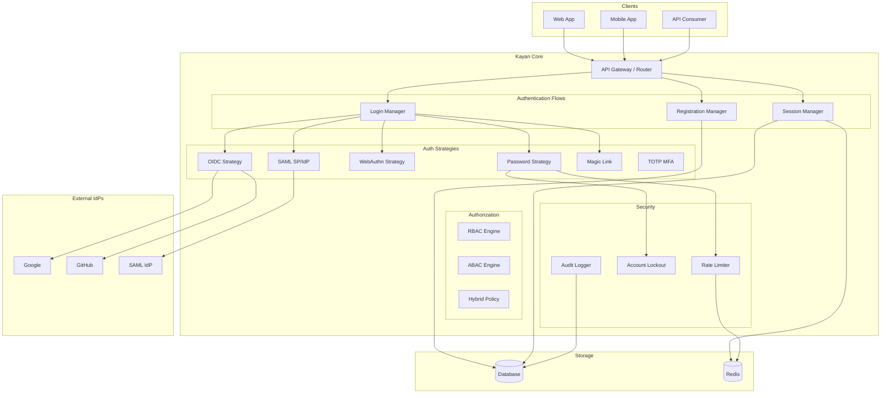
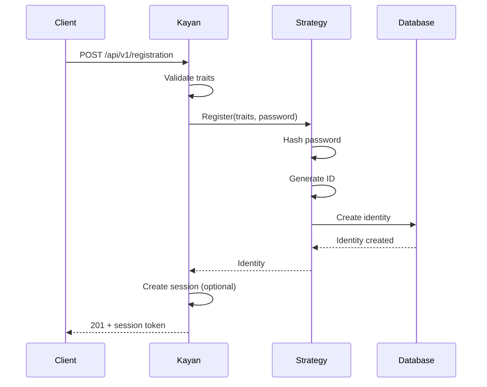
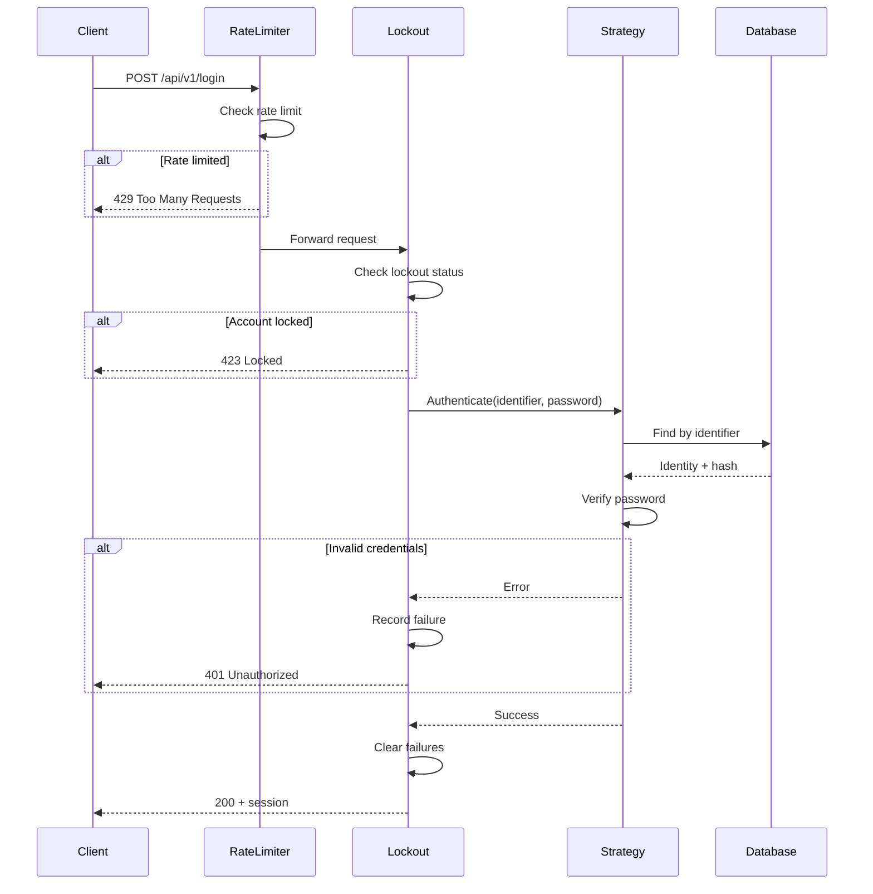
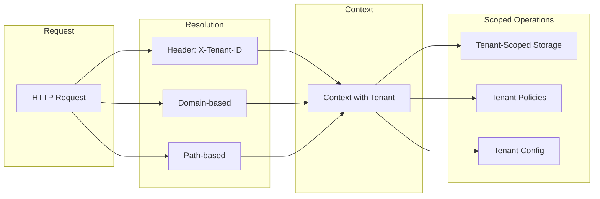

# Kayan Architecture

Kayan is a **headless, non-generic, and highly extensible authentication service** built for Go applications.

## System Overview



## Core Components

### 1. Identity Model

Kayan uses a **non-generic architecture** with the `any` interface, allowing any ID type:

```go
type FlowIdentity interface {
    GetID() any
    SetID(id any)
}
```

### 2. Authentication Strategies

| Strategy | Description | Use Case |
|----------|-------------|----------|
| `PasswordStrategy` | Bcrypt-based password auth | Traditional login |
| `OIDCStrategy` | OpenID Connect social login | Google, GitHub, etc. |
| `WebAuthnStrategy` | Passkeys/FIDO2 | Passwordless, MFA |
| `SAMLStrategy` | SAML 2.0 SP/IdP | Enterprise SSO |
| `MagicLinkStrategy` | Email-based login | Passwordless |
| `TOTPStrategy` | Time-based OTP | MFA |

### 3. Security Decorators

Strategies can be wrapped with security decorators:

```
LoginStrategy
     │
     ▼
 RateLimitStrategy (decorator)
     │
     ▼
 LockoutStrategy (decorator)
     │
     ▼
 PasswordStrategy (actual implementation)
```

### 4. Session Management

Two session strategies:
- **DatabaseStrategy** - Opaque tokens stored in DB
- **JWTStrategy** - Stateless JWT tokens

### 5. Authorization

| Model | File | Description |
|-------|------|-------------|
| RBAC | `policy/rbac.go` | Role-based access control |
| ABAC | `policy/abac.go` | Attribute-based access control |
| Hybrid | `policy/hybrid.go` | Combine multiple engines |

---

## Data Flow

### Registration Flow



### Login Flow



---

## Multi-Tenancy

Kayan supports full multi-tenancy with tenant isolation:



---

## Storage Architecture

### Repository Pattern

```go
type IdentityRepository interface {
    Create(ctx context.Context, identity any) error
    FindByIdentifier(ctx context.Context, identifier string) (any, error)
    FindByID(ctx context.Context, id any) (any, error)
    Update(ctx context.Context, identity any) error
    Delete(ctx context.Context, id any) error
}
```

### GORM Implementation

The `kgorm` package provides GORM-based implementations:

- `IdentityRepository` - User storage
- `SessionRepository` - Session storage
- `OAuth2Repository` - OAuth2 client/token storage

---

## Deployment Patterns

### Single Instance

```
┌─────────────────────────────┐
│         Kayan Server        │
│  ┌───────────────────────┐  │
│  │    All Components     │  │
│  └───────────────────────┘  │
│             │               │
│  ┌──────────┴──────────┐    │
│  ▼                     ▼    │
│ [PostgreSQL]       [Redis]  │
└─────────────────────────────┘
```

### High Availability

```
         ┌─────────────────┐
         │  Load Balancer  │
         └────────┬────────┘
                  │
    ┌─────────────┼─────────────┐
    ▼             ▼             ▼
┌───────┐    ┌───────┐    ┌───────┐
│Kayan 1│    │Kayan 2│    │Kayan 3│
└───┬───┘    └───┬───┘    └───┬───┘
    │            │            │
    └────────────┼────────────┘
                 │
    ┌────────────┴────────────┐
    ▼                         ▼
┌─────────────┐       ┌──────────────┐
│ PostgreSQL  │       │ Redis Cluster│
│  Primary    │       │              │
│     │       │       └──────────────┘
│   Replica   │
└─────────────┘
```

---

## Security Model

### Defense in Depth

1. **Network Layer** - TLS, firewall rules
2. **Rate Limiting** - Per-IP, per-user limits
3. **Account Lockout** - Brute force protection
4. **Password Hashing** - Bcrypt with configurable cost
5. **Session Security** - Rotation, expiry, revocation
6. **Audit Logging** - All security events logged

### Threat Mitigations

| Threat | Mitigation |
|--------|------------|
| Brute Force | Rate limiting + Account lockout |
| Credential Stuffing | Rate limiting + breach detection hooks |
| Session Hijacking | Secure cookies, rotation, binding |
| CSRF | Double-submit cookies, SameSite |
| Token Leakage | Short-lived tokens, refresh rotation |
