# Authentication Flows

This document details all authentication flows supported by Kayan.

## Table of Contents

- [Password Authentication](#password-authentication)
- [OIDC/Social Login](#oidcsocial-login)
- [WebAuthn/Passkeys](#webauthnpasskeys)
- [SAML 2.0](#saml-20)
- [Magic Link](#magic-link)
- [Multi-Factor Authentication](#multi-factor-authentication)

---

## Password Authentication

### Registration

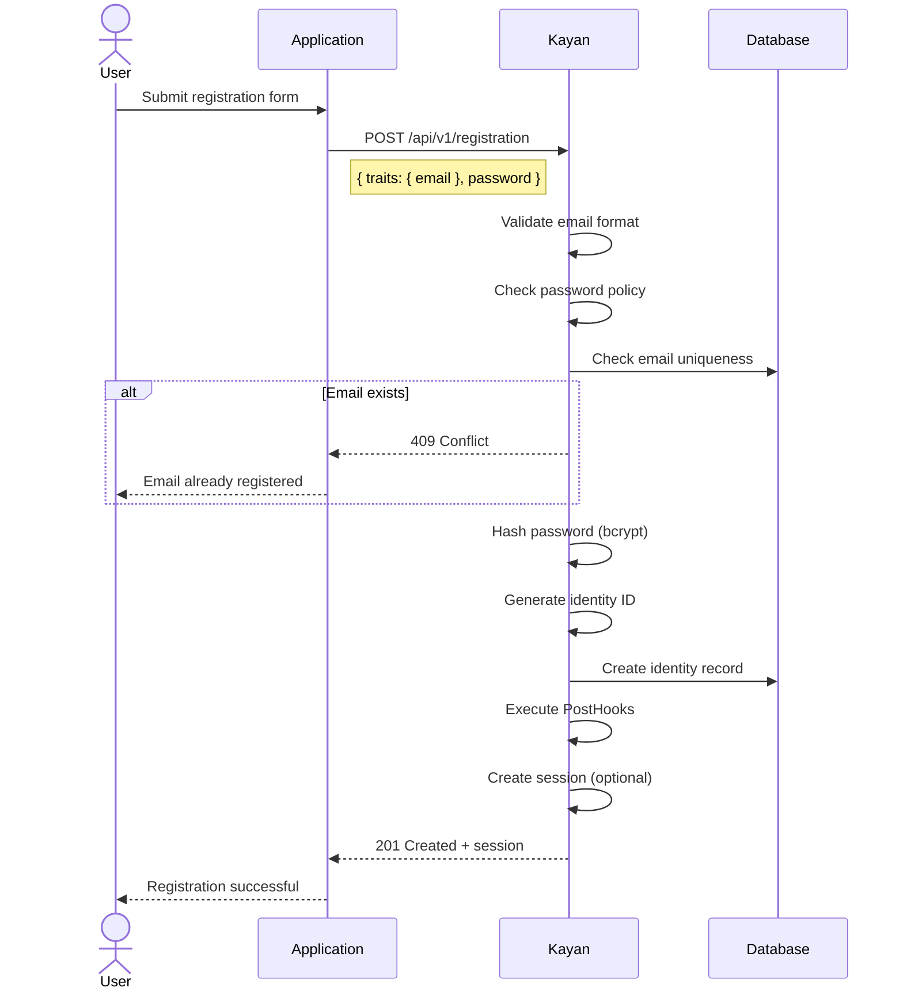

### Login

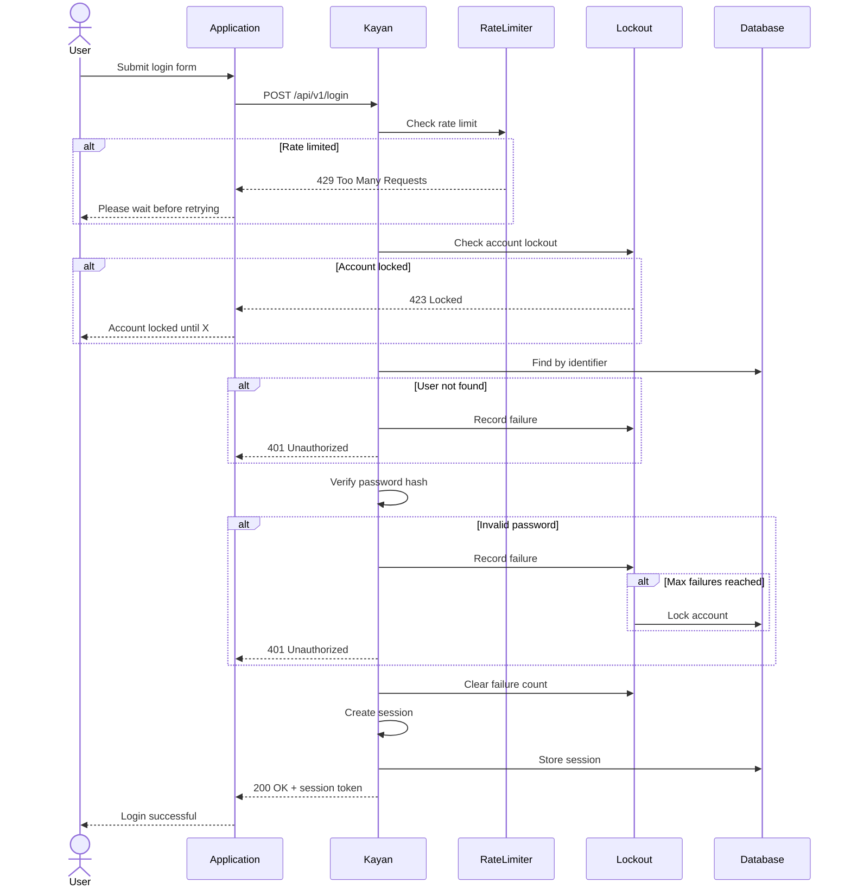

---

## OIDC/Social Login

### Authorization Code Flow

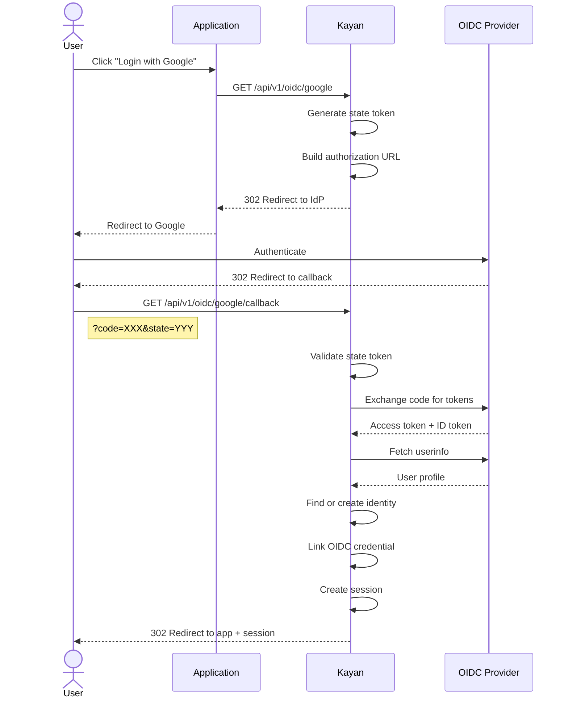

### Supported Providers

| Provider | Discovery URL | Scopes |
|----------|---------------|--------|
| Google | `https://accounts.google.com` | openid, email, profile |
| GitHub | N/A (manual config) | user:email |
| Microsoft | `https://login.microsoftonline.com/{tenant}/v2.0` | openid, email, profile |
| Apple | `https://appleid.apple.com` | openid, email, name |

---

## WebAuthn/Passkeys

### Registration (Attestation)

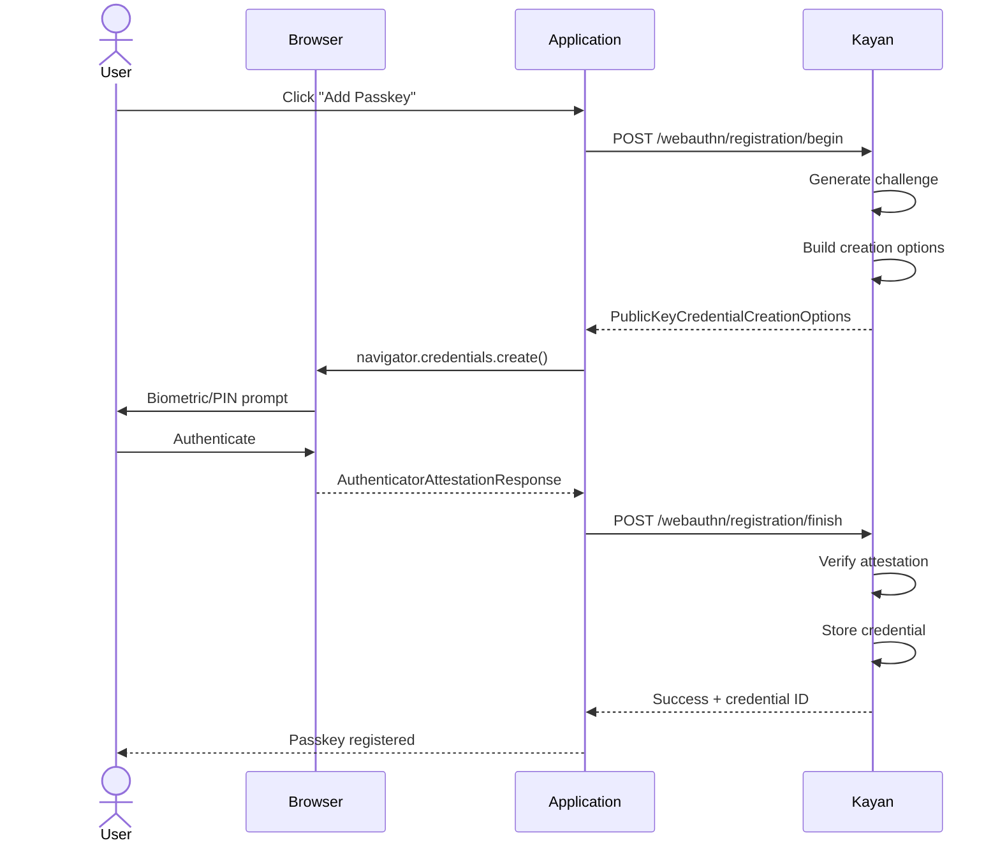

### Login (Assertion)

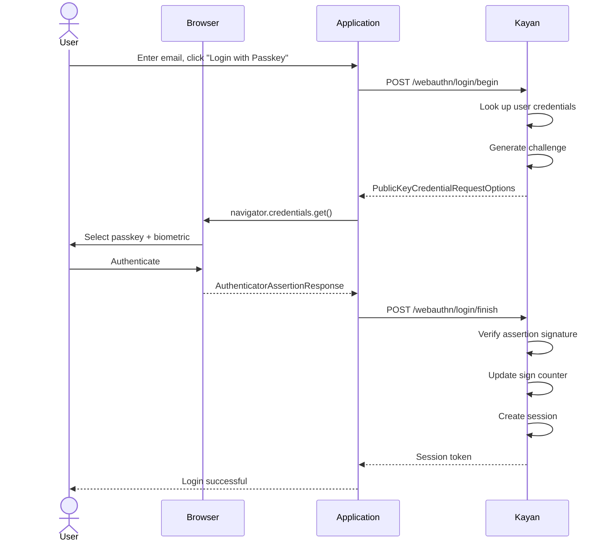

---

## SAML 2.0

### SP-Initiated SSO

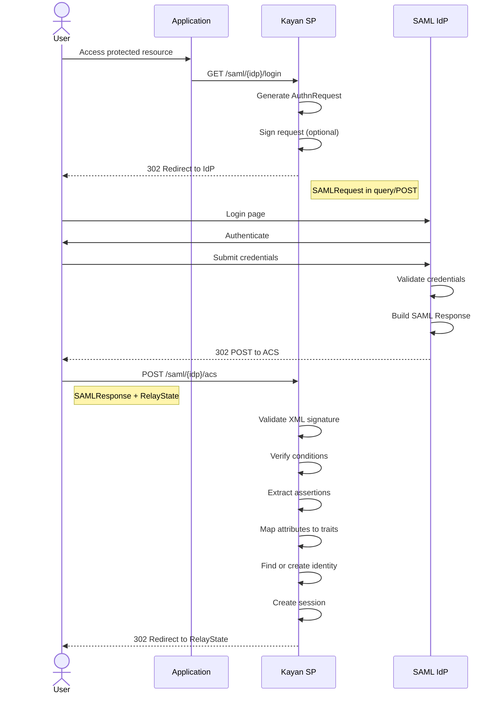

### IdP-Initiated SSO

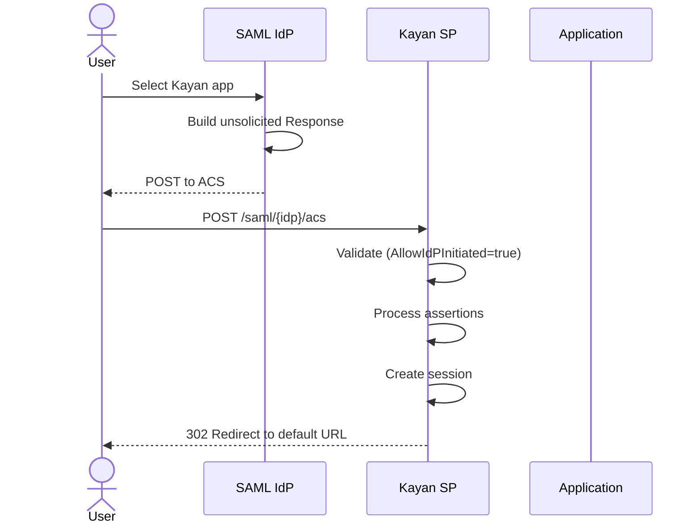

---

## Magic Link

### Request Link

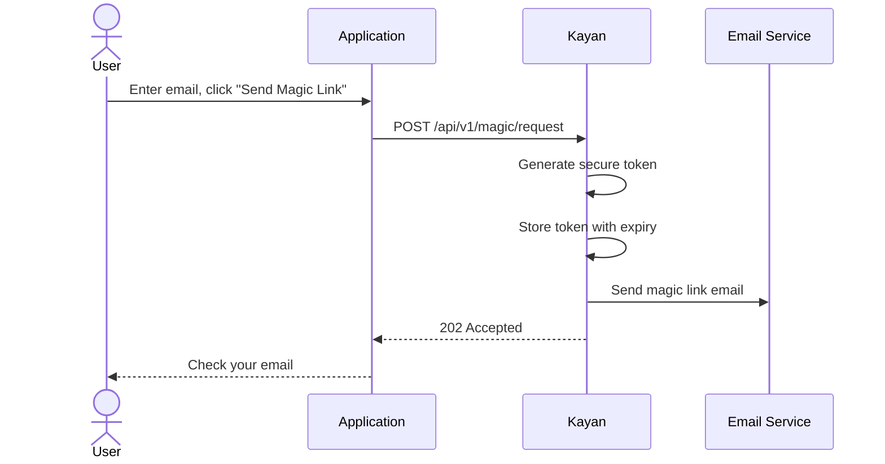

### Verify Link

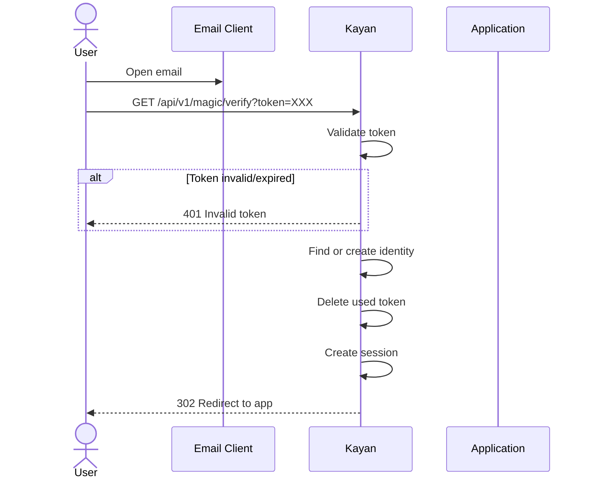

---

## Multi-Factor Authentication

### TOTP Enrollment

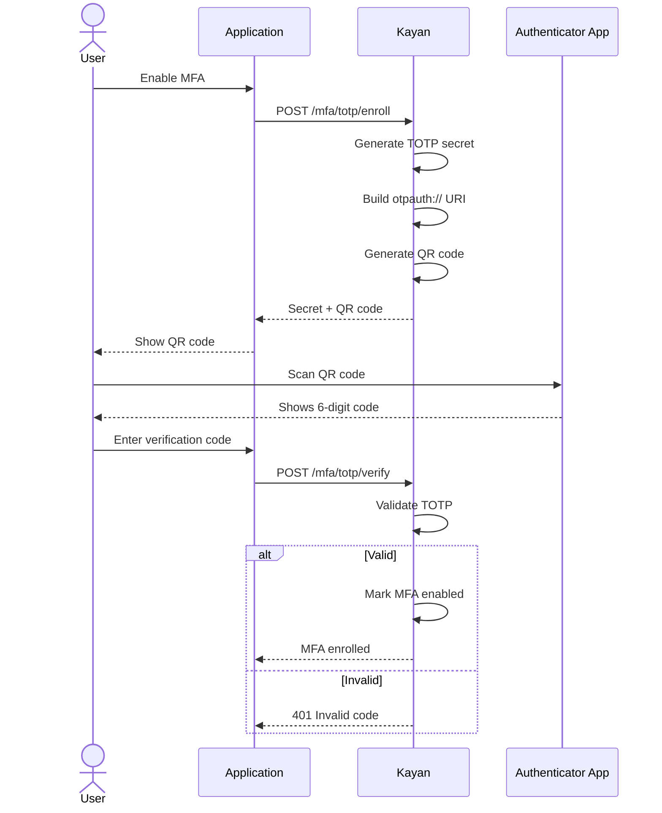

### MFA Challenge during Login

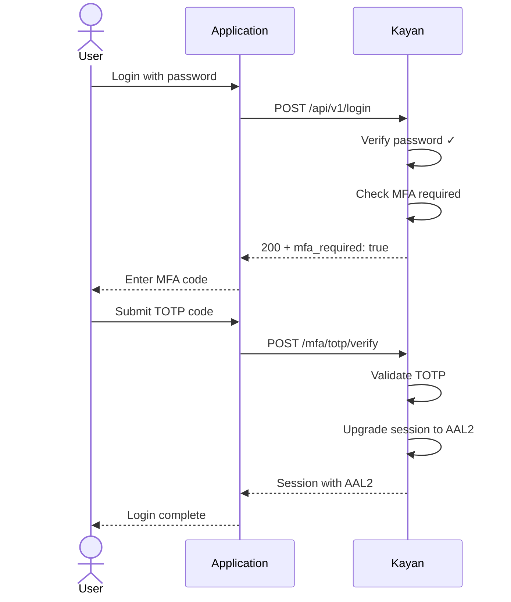

---

## Session Lifecycle

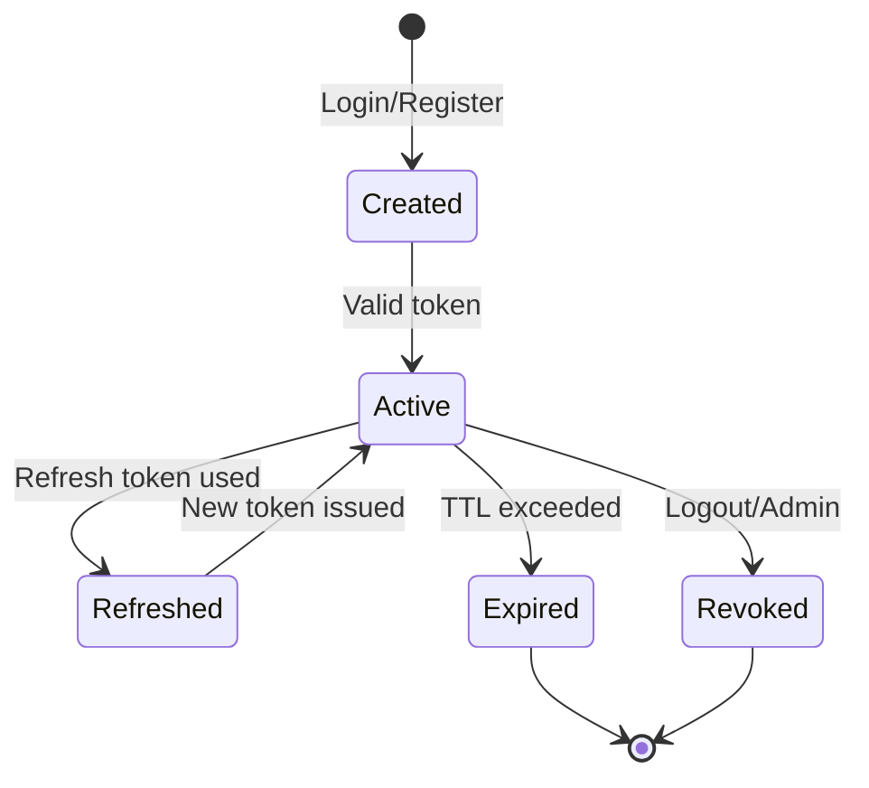

### Token Refresh Flow

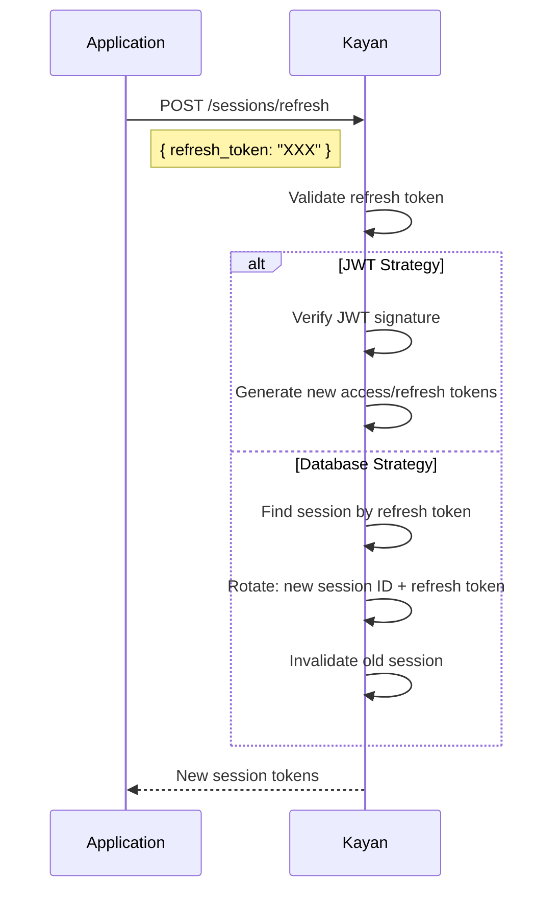
