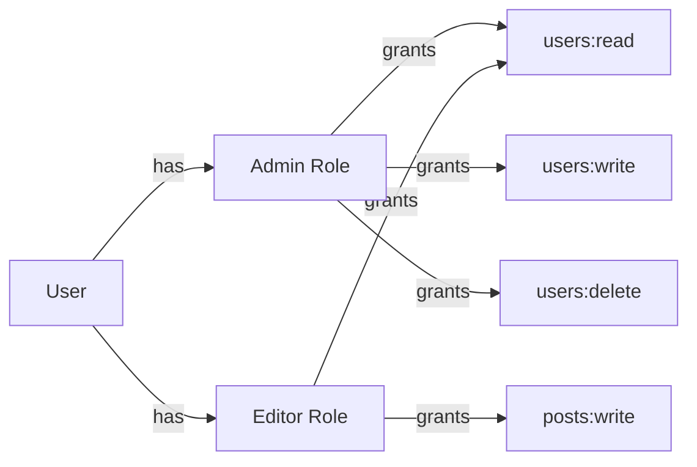
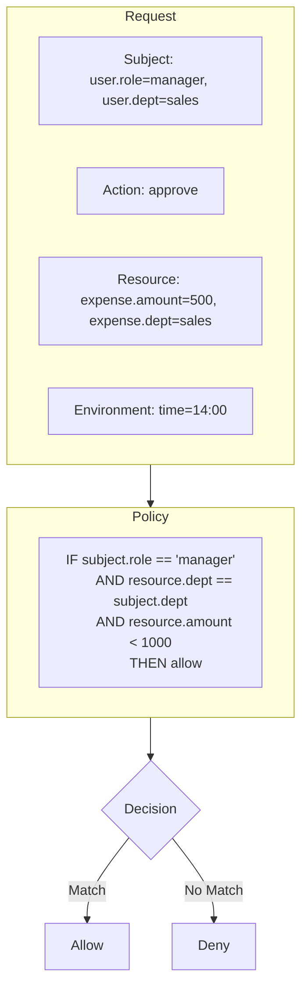
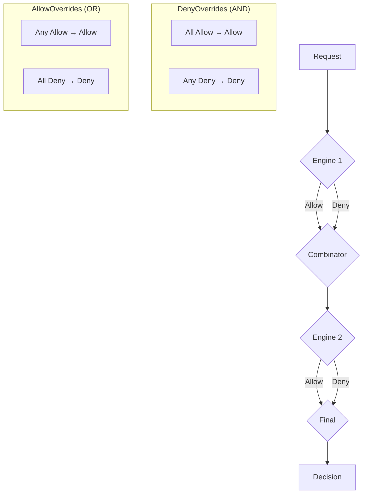

# Authorization Models

Kayan provides flexible authorization with multiple policy engines that can be used independently or combined.

## Overview

| Model | Use Case | Complexity |
|-------|----------|------------|
| **RBAC** | Role-based permissions | Simple |
| **ABAC** | Attribute-based policies | Medium |
| **ReBAC** | Relationship-based access | Complex |
| **Hybrid** | Combined engines | Custom |

---

## RBAC (Role-Based Access Control)

### Concept

Users are assigned **roles**, and roles have **permissions**.



### Usage

```go
package main

import (
    "github.com/getkayan/kayan/core/policy"
    "github.com/getkayan/kayan/core/rbac"
)

func main() {
    // Create RBAC engine with in-memory storage
    storage := rbac.NewMemoryStorage()
    engine := policy.NewRBACEngine(storage)
    
    // Define roles and permissions
    engine.CreateRole("admin", []string{
        "users:read", "users:write", "users:delete",
        "posts:read", "posts:write", "posts:delete",
    })
    
    engine.CreateRole("editor", []string{
        "posts:read", "posts:write",
    })
    
    // Assign role to user
    engine.AssignRole("user-123", "editor")
    
    // Check permission
    allowed, _ := engine.Can(ctx, "user-123", "posts:write", nil)
    // allowed = true
}
```

### Middleware

```go
// Protect routes with RBAC
e.POST("/posts", createPost, 
    policy.RequirePermission(engine, "posts:write"))

e.DELETE("/posts/:id", deletePost,
    policy.RequireAnyPermission(engine, "posts:delete", "admin:all"))
```

---

## ABAC (Attribute-Based Access Control)

### Concept

Access decisions based on **attributes** of:
- Subject (user properties)
- Resource (object properties)
- Action (operation type)
- Environment (time, location, etc.)



### Usage

```go
// Create ABAC engine
engine := policy.NewABACEngine()

// Define policy rules
engine.AddRule(policy.Rule{
    Name: "managers-approve-dept-expenses",
    Condition: func(ctx context.Context, subject, action string, resource any) bool {
        user := GetUserFromContext(ctx)
        expense := resource.(*Expense)
        
        return user.Role == "manager" &&
               user.Department == expense.Department &&
               expense.Amount < 1000
    },
    Effect: policy.Allow,
})

// Check access
allowed, _ := engine.Can(ctx, userID, "approve", expense)
```

### Dynamic Attributes

```go
// Register attribute resolver
engine.SetAttributeResolver(func(ctx context.Context, subjectID string) map[string]any {
    user := loadUser(subjectID)
    return map[string]any{
        "role":       user.Role,
        "department": user.Department,
        "clearance":  user.ClearanceLevel,
        "ip":         GetIPFromContext(ctx),
        "time":       time.Now(),
    }
})
```

---

## Hybrid Authorization

Combine multiple engines with configurable combination logic.

### Combinators

| Combinator | Logic | Use Case |
|------------|-------|----------|
| `DenyOverrides` | All must allow (AND) | Strict security |
| `AllowOverrides` | Any can allow (OR) | Flexible access |

### Usage

```go
// Create individual engines
rbacEngine := policy.NewRBACEngine(storage)
abacEngine := policy.NewABACEngine()

// Combine with DenyOverrides (AND logic)
// User must pass BOTH RBAC and ABAC checks
hybrid := policy.NewHybridStrategy(
    policy.DenyOverrides,
    rbacEngine,
    abacEngine,
)

// Use in middleware
e.Use(policy.EnforcePolicy(hybrid))

// Or check manually
allowed, _ := hybrid.Can(ctx, userID, "documents:read", document)
```

### Example: Role + Ownership

```go
// RBAC: Must have documents:read permission
// ABAC: Must own the document OR be admin

rbacEngine.CreateRole("user", []string{"documents:read"})
rbacEngine.CreateRole("admin", []string{"documents:read", "admin:all"})

abacEngine.AddRule(policy.Rule{
    Name: "owner-access",
    Condition: func(ctx context.Context, subject, action string, resource any) bool {
        doc := resource.(*Document)
        return doc.OwnerID == subject
    },
    Effect: policy.Allow,
})

abacEngine.AddRule(policy.Rule{
    Name: "admin-access",
    Condition: func(ctx context.Context, subject, action string, resource any) bool {
        user := GetUserFromContext(ctx)
        return user.Role == "admin"
    },
    Effect: policy.Allow,
})

// Combine with AllowOverrides for ABAC (owner OR admin)
// Then DenyOverrides with RBAC (must have permission)
ownerOrAdmin := policy.NewHybridStrategy(policy.AllowOverrides, abacEngine)
final := policy.NewHybridStrategy(policy.DenyOverrides, rbacEngine, ownerOrAdmin)
```

---

## Multi-Tenant Authorization

### Tenant-Scoped Roles

```go
// Roles are scoped to tenant
engine.AssignRole("user-123", "admin", rbac.WithTenant("tenant-abc"))

// Check within tenant context
ctx = tenant.WithTenantID(ctx, "tenant-abc")
allowed, _ := engine.Can(ctx, "user-123", "users:delete", nil)
```

### Cross-Tenant Policies

```go
// Global admin role (no tenant scope)
engine.CreateRole("super-admin", []string{"*:*"})
engine.AssignRole("user-456", "super-admin") // No tenant = global

// Check allows cross-tenant access
allowed, _ := engine.Can(ctx, "user-456", "tenants:manage", nil)
```

---

## Policy Decision Flow



---

## Best Practices

### 1. Start Simple

```go
// Start with RBAC for basic permission checks
engine := policy.NewRBACEngine(storage)
```

### 2. Add ABAC for Complex Rules

```go
// Add ABAC when you need dynamic conditions
// like ownership, time-based access, etc.
```

### 3. Use Hybrid for Defense in Depth

```go
// Combine for layered security
hybrid := policy.NewHybridStrategy(policy.DenyOverrides, rbac, abac)
```

### 4. Cache Wisely

```go
// Use cached storage for frequently checked permissions
storage := rbac.NewCachedStorage(
    rbac.NewDatabaseStorage(db),
    cache,
    5*time.Minute,
)
```

### 5. Audit All Decisions

```go
// Log authorization decisions for compliance
engine.SetAuditLogger(func(ctx context.Context, decision policy.Decision) {
    audit.Log(ctx, "authorization", decision)
})
```
